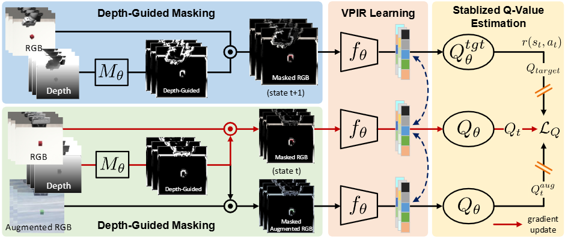

# DeGuV: Depth-Guided Visual Reinforcement Learning for Generalization and Interpretability in Manipulation

We have released DeGuV -- a **De**pth-**Gu**ided **Vi**sual Reinforcement Learning model targetting Generalization and Interpretability.

<p align="center">
  <br />
  <a href="./LICENSE"></a>
  <a href="Python 3.8"></a>
  <a href="https://github.com/psf/black"></a>
</p>

<p align="center">
  
</p>

<p align="center">
  
</p>

## Intallation

Clone the DeGuV repo:

```
git clone https://github.com/tiencapham/DeGuV.git
cd DeGuV/
```

Create a conda environment:

```
conda create -n deguv python=3.8
bash setup/install_deguv.sh
```

## Code Structure

- `algos`: contains the implementation of different algorithms.
- `cfgs`: contains the hyper-parameters for different algorithms and each tasks.
- `envs`: RL-ViGen benchmark environments. In addtion, each sub-folder contains specific `README.md` for the introduction of the environment.
- `setup`: the installation scripts for conda envs.
- `third_party`: submodules from third parties. We won't frequently change the code in this folder.
- `wrappers`: includes the wrappers for each environment.
- `scripts`: includes scripts that facilitate training and evaluation.

## Extra Datasets

The algorithms will use the [Places](http://places2.csail.mit.edu/download.html) dataset for data augmentation, which can be downloaded by running

```
wget http://data.csail.mit.edu/places/places365/places365standard_easyformat.tar
```

After downloading and extracting the data, add your dataset directory to the datasets list in `cfgs/aug_config.cfg`.

## Training

```
cd DeGuV/
bash scripts/train.sh
```

## Evaluation

For evaluation, please place the `snapshot.pt` of your model in the `eval/{task}/{model_name}` such as `eval/Lift/deguv/`. We also provides the pretrain `DeGuV` on Lift task [here](https://drive.google.com/file/d/1fbdIEXYZXdD8eGaOxSet2bqqvS_wjHBv/view?usp=drive_link). Then you can start to run the evaluation by:

```
cd DeGuV/
bash scripts/eval.sh
```

You can also change the evaluation mode in `eval.sh` script from `train` to `eval-easy, eval-medium` and `eval-hard`.

## Acknowledgements

Our training code is based on [DrQv2](https://github.com/facebookresearch/drqv2) and [RL-ViGen](https://github.com/gemcollector/RL-ViGen)
And we also thank the codebase of [VRL3](https://github.com/microsoft/VRL3), [DMC-GB](https://github.com/nicklashansen/dmcontrol-generalization-benchmark), [SECANT](https://github.com/DrJimFan/SECANT).

## License

The majority of RL-ViGen, DrQ-v2, DMCGB, VRL3 is licensed under the MIT license. Habitat Lab, dmc2gym, mujoco-py are also licensed under the MIT license. However portions of the project are available under separate license terms: DeepMind, mj_envs, and mjrl is licensed under the Apache 2.0 license. Gibson based task datasets, the code for generating such datasets, and trained models are distributed with [Gibson Terms of Use](https://storage.googleapis.com/gibson_material/Agreement%20GDS%2006-04-18.pdf) and under [CC BY-NC-SA 3.0 US license](https://creativecommons.org/licenses/by-nc-sa/3.0/us/). CARLA specific assets are distributed under CC-BY License. The ad-rss-lib library compiled and linked by the [RSS Integration build variant](Docs/adv_rss.md) introduces [LGPL-2.1-only License](https://opensource.org/licenses/LGPL-2.1)
